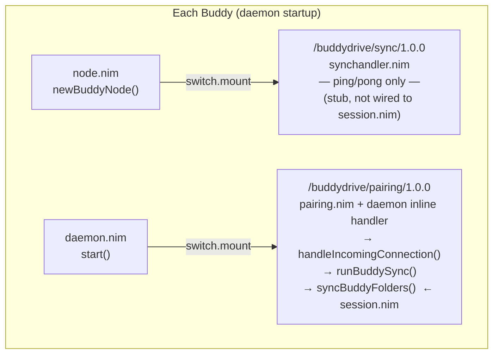
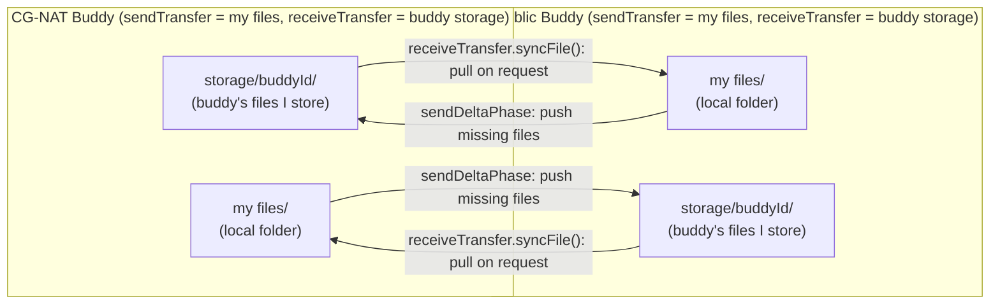

# BuddyDrive Architecture

## Connection & Sync Flow

```mermaid
sequenceDiagram
    participant API as Discovery API<br/>api.buddydrive.org
    participant CG as CG-NAT Buddy
    participant R as Relay Server<br/>relay-eu.buddydrive.org
    participant PB as Public Buddy

    Note over CG,PB: 1 · Discovery (every 10 min)
    CG->>API: POST /discovery/<key>  {addrs, reachable=false}
    PB->>API: POST /discovery/<key>  {addrs, reachable=true}
    CG->>API: GET /discovery/<key>
    API-->>CG: buddy addrs + reachable=true

    Note over CG,PB: 2 · Connection  (CG-NAT side always initiates — public side can't dial in)
    alt direct TCP reachable
        CG->>PB: dial /buddydrive/pairing/1.0.0
    else no public address (CG-NAT)
        CG->>R: connect, send pairing token
        PB->>R: connect, send pairing token
        Note over CG,R,PB: relay splices the two TCP streams
    end

    Note over CG,PB: 3 · Handshake  (over PairingProtocol)
    CG->>PB: performHandshake()
    PB-->>CG: acceptHandshake()

    Note over CG,PB: 4 · Sync session  (both sides call syncBuddyFolders on same conn)
    par exchange file lists
        CG->>PB: sendFileList  (my folders)
    and
        PB->>CG: sendFileList  (my folders)
    end

    Note over CG,PB: order of delta phase = UUID comparison (not who initiated TCP)

    CG->>PB: sendDeltaPhase  — push my files + request buddy's files
    PB-->>CG: serve file data
    PB->>CG: sendDeltaPhase  — push my files + request buddy's files
    CG-->>PB: serve file data

    Note over CG,PB: 5 · /buddydrive/sync/1.0.0  (mounted separately, independent of above)
    CG->>PB: msgPing
    PB-->>CG: msgPong  ← stub only, not used for file sync
```

## Protocol Mounting



## Bidirectional Sync (per folder, per session)


